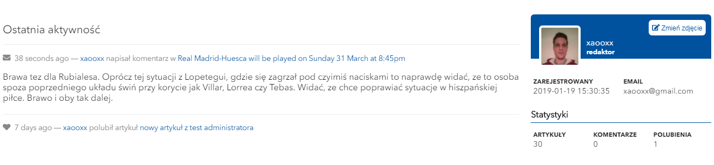

## About Project
Website that provides global (mainly spanish) information about spanish club Real Madrid C.F. for polish fans. 

## Technologies Used
### Frontend side
HTML, CSS, JS, ReactJS, Redux

### Backend side
MySQL, PHP, Laravel

## Screenshots

## Contributions
Bartosz Lorek - [@me](mailto:balorek@interia.pl)

Marcin Murach - [github](https://github.com/Marcin250)

